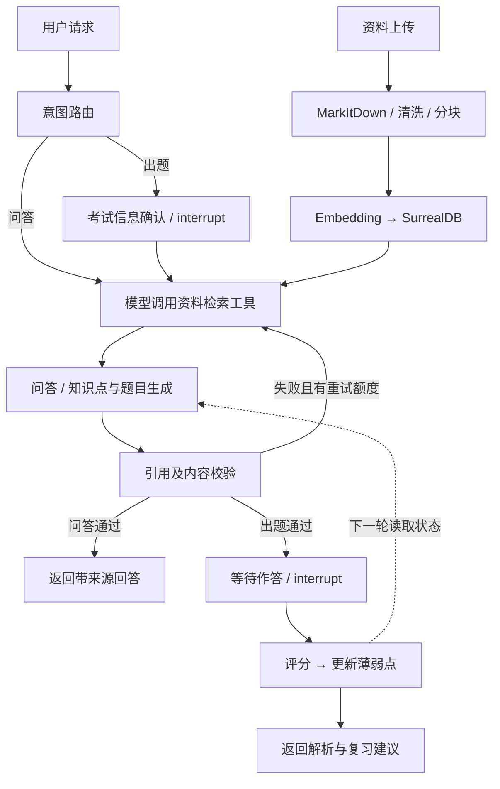

# Final Review Agent

基于 **LangChain + LangGraph + SurrealDB** 的期末复习 Agent 后端。可独立运行，也可作为学习系统中的一个 Agent 模块使用。

接收课程资料，完成资料入库、带来源问答、模拟出题、作答评测与薄弱点反馈。原有 [SKILL.md](SKILL.md) 保留为领域规范；[policy.py](src/final_review/policy.py) 和工作流把关键规则落实为代码。

## 能力与实现

| 能力 | 实现 |
| --- | --- |
| 资料处理 | MarkItDown 转 PDF/PPTX/DOCX；Markdown 清洗、分块去重、Embedding、事务入库 |
| RAG | 课程/章节过滤 → SurrealDB 精确余弦召回 → 相关性阈值 → 题源加权重排 |
| Tool Calling | 模型调用 search_course_material，实际执行 LangChain Retriever，并接收 ToolMessage；最多两轮 |
| 结构化输出 | ChatModel + PromptTemplate + Pydantic，结构错误有限重试 |
| 工作流 | LangGraph StateGraph、条件路由、证据校验回环、人工输入中断 |
| 复习策略 | 真题优先；按知识点分配 1～6 题；验证考试题型与题量；保留得分解析 |
| 反馈闭环 | 出题 → 用户作答 → 评分 → 更新会话薄弱点 → 下一轮优先覆盖 |
| 恢复 | 自定义 SurrealDB Checkpointer，保存图状态、父检查点、pending writes |
| 交付 | FastAPI /docs、JSON 响应、题答分离 Markdown 导出、Docker Compose |



只有一个 FinalReviewAgent；图中其余步骤是确定性节点或模型调用。具体取舍见 [架构说明](docs/architecture.md)。

## 快速启动

需要 Python 3.11+、[uv](https://docs.astral.sh/uv/)、SurrealDB 2.3.10，以及支持 Tool Calling 的聊天模型和 Embedding 模型。两个模型可来自不同的 OpenAI 兼容提供商。

```powershell
uv sync --frozen
Copy-Item .env.example .env
# 编辑 .env，填入模型 Key、模型名称、URL 和 SURREAL_PASSWORD
docker compose up -d surrealdb
uv run uvicorn final_review.api:create_app --factory --host 127.0.0.1 --port 8080 --workers 1
```

打开 [接口文档](http://127.0.0.1:8080/docs)。也可使用本机 SurrealDB，修改 SURREAL_URL 即可。

全 Docker 启动：

```powershell
docker compose up --build -d
```

数据库写入 Compose 命名卷。默认只映射本机端口。当前实现使用单进程会话锁，**保持 --workers 1，不要运行多个后端副本**。

| 配置 | 含义 |
| --- | --- |
| LLM_API_KEY / LLM_BASE_URL / LLM_MODEL | 聊天模型，须支持工具调用 |
| EMBEDDING_API_KEY / EMBEDDING_BASE_URL / EMBEDDING_MODEL | Embedding 提供商 |
| EMBEDDING_DIMENSIONS | 必须匹配实际维度；提供商接口需接受 dimensions 参数 |
| SURREAL_* | 数据库连接、认证与 namespace/database |
| API_TOKEN | 可选 Bearer Token；共享部署时配置 |
| TOP_K / RETRIEVAL_CANDIDATES | 最终上下文数 / 初始召回数，默认 5 / 20 |
| MIN_SIMILARITY / MAX_REPAIRS | 相关性阈值 / 校验最大修复次数，默认 0.25 / 1 |

启动时核对数据库内的 Embedding 配置。更换模型、维度或提供商地址时，使用新的 SURREAL_DATABASE 重新入库，避免混用向量空间。

## 跑通一次复习

```powershell
uv run python examples/demo.py
```

示例上传 [教学资料](examples/course.md)，执行问答、出题，然后在终端输入答案并获取反馈。教学资料属于 **AI 补充示例**，不伪标为真实授课材料。脚本使用真实后端与模型；启用 API_TOKEN 时也需将其提供给脚本环境。

在 /docs 手动演示：

1. POST /knowledge/ingest 上传 Markdown；或 /knowledge/upload 上传文件。
2. POST /agent/invoke 问答或出题。
3. 返回 needs_input 时，用 /agent/resume 提交考试信息。
4. 返回 awaiting_answers 时，用 /assessment/evaluate 提交全部答案。
5. GET /agent/export 导出 Markdown，所有题目在前、答案与解析统一在后。

资料入库请求：

```json
{
  "course_id": "network",
  "title": "TCP 教学示例",
  "source_type": "ai_supplement",
  "chapter": "TCP",
  "markdown": "TCP 三次握手用于同步双方初始序列号。"
}
```

出题请求：

```json
{
  "course_id": "network",
  "session_id": "review-001",
  "intent": "quiz",
  "message": "围绕 TCP 三次握手出题，重点练习原因分析",
  "chapter": "TCP",
  "exam_profile": {
    "question_types": ["short_answer", "fill_blank"],
    "emphasis": ["三次握手"],
    "excluded_topics": []
  }
}
```

intent 支持 auto / ask / quiz。不提供 exam_profile 时，出题流程暂停，等待用户确认。后续同一会话沿用已确认信息，也可显式传入新信息。

作答请求：

```json
{
  "course_id": "network",
  "session_id": "review-001",
  "answers": {
    "本轮返回的完整题目ID": "我的答案"
  }
}
```

answers 的键必须覆盖本轮所有题目 ID。ID 每轮独立，旧答案不会误用于新题。评分响应包含 assessment.score、逐题反馈、参考答案、weak_points 和 suggestions。同一轮相同答案重试直接返回已有结果。

| 接口 | 用途 |
| --- | --- |
| GET /health | 进程存活检查；不表示模型可用 |
| POST /knowledge/ingest | Markdown 入库 |
| POST /knowledge/upload | 文件转换入库 |
| POST /agent/invoke | 开始一轮问答或测评 |
| POST /agent/resume | 补充考试信息，恢复中断 |
| POST /assessment/evaluate | 提交完整答案，评分并反馈 |
| GET /agent/session?course_id=...&session_id=... | 读取公开状态 |
| POST /agent/recover?course_id=...&session_id=... | 恢复故障后的未完成节点 |
| GET /agent/export?course_id=...&session_id=... | 导出结果为 Markdown |

等待作答时不返回参考答案、得分规则或含答案的资料正文。未知会话返回 404，错误操作顺序返回 409，非法输入返回 422，模型/数据库故障返回 502/503。

## 测试

```powershell
uv run pytest -q
uv run ruff check src tests examples eval
uv run ruff format --check src tests examples eval
```

默认测试使用显式测试 adapter，不需要模型 Key。覆盖真实 LangGraph 与 LangChain 请求编解码，但这不是模型准确率评测。

真实数据库集成测试创建、删除独立的 final_review_tests/test_<uuid> 数据库：

```powershell
$env:SURREAL_TEST_URL='http://127.0.0.1:8000'
$env:SURREAL_TEST_USER='root'
$env:SURREAL_TEST_PASSWORD='你的本地数据库密码'
uv run pytest -m integration -q
```

真实模型评测见 [eval/README.md](eval/README.md)。不预填准确率或检索提升百分比。

## 范围与限制

- 单进程、可信环境后端；资料和会话按 course_id 隔离，薄弱点在同一 session_id 累计。没有登录系统和多租户权限。
- 检索是数据库内精确余弦计算，不是 HNSW、混合检索或训练后的 Reranker。题源权重与阈值是启发式，需要真实课程数据调参。
- 引用 ID/原文匹配是确定性校验，语义支持由模型复核。模型复核、出题和评分仍可能出错，不能当作形式证明或权威考试成绩。
- 小型语料采用字符分块、轻量清洗和分块去重。扫描件先 OCR；复杂公式与版式需抽查转换结果。
- 已完成步骤可恢复；失败节点可能重新调用模型并产生费用。尚无分布式锁、检查点自动清理和任务取消接口。
- 后端输出 JSON/Markdown；完整 HTML 交互规范保留在 Skill 中，当前后端没有 HTML 页面生成器。

## 仓库结构

```text
src/final_review/
  agent.py          # 图、状态、中断、反馈闭环
  llm.py            # LangChain 模型、工具循环、结构化输出
  rag.py            # 清洗、Embedding、Retriever、题源重排
  storage.py        # SurrealDB 事务、向量查询、业务记录
  checkpoints.py    # SurrealDB LangGraph Checkpointer
  schemas.py        # 请求、证据、知识点、题目、评分模型
  policy.py         # Skill 对应的可执行规则
  api.py            # FastAPI
  rendering.py      # 题答分离 Markdown
tests/              # 工作流、接口、模型协议、真实数据库测试
eval/               # 可运行的真实模型评测
examples/           # 教学资料与端到端演示
docs/               # 架构与取舍
SKILL.md            # 完整领域规范，可继续独立作为 Skill 使用
AGENTS.md           # 仓库长期复习规则
```

技术参考：[LangGraph 持久化](https://docs.langchain.com/oss/python/langgraph/persistence)、[人工中断](https://docs.langchain.com/oss/python/langgraph/interrupts)、[LangChain 模型](https://docs.langchain.com/oss/python/langchain/models)、[SurrealDB 向量函数](https://surrealdb.com/docs/reference/query-language/functions/database-functions/vector)。
