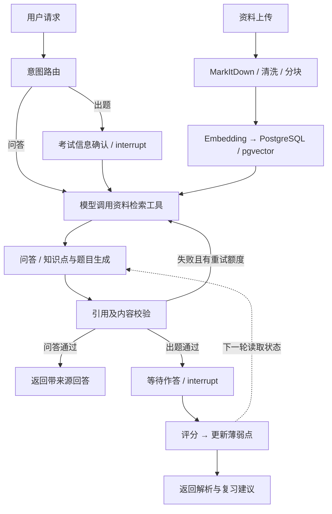

# Final Review Agent

基于 **LangChain + LangGraph + PostgreSQL/pgvector** 的期末复习 Agent 后端。可独立运行，也可作为学习系统中的一个 Agent 模块使用。

接收课程资料，完成资料入库、带来源问答、模拟出题、作答评测与薄弱点反馈。原有 [SKILL.md](SKILL.md) 保留为领域规范；[policy.py](src/final_review/policy.py) 和工作流把关键规则落实为代码。

## 能力与实现

| 能力 | 实现 |
| --- | --- |
| 资料处理 | PDF/DOCX 用 MarkItDown；PPT/PPTX 保留原生文字并逐页转 PDF、渲染图片补充中英文 OCR；旧版 DOC 经 LibreOffice 转换；PNG/JPG/WebP 经 OCR；随后清洗、分块、Embedding、事务入库 |
| RAG | 课程/章节过滤 → PostgreSQL/pgvector 召回 → 相关性阈值 → 题源加权重排 |
| 认证与隔离 | FastAPI 自管 Argon2id 密码、HttpOnly Session Cookie；所有业务查询绑定 Session 的 user_id |
| Tool Calling | 模型调用 search_course_material，实际执行 LangChain Retriever，并接收 ToolMessage；最多两轮 |
| 结构化输出 | ChatModel + PromptTemplate + Pydantic，结构错误有限重试 |
| 工作流 | LangGraph StateGraph、条件路由、证据校验回环、人工输入中断 |
| 复习策略 | 真题优先；按知识点分配 1～6 题；验证考试题型与题量；保留得分解析 |
| 反馈闭环 | 出题 → 用户作答 → 评分 → 更新会话薄弱点 → 下一轮优先覆盖 |
| 恢复 | 自定义 PostgreSQL Checkpointer，保存图状态、父检查点、pending writes |
| 笔记复核 | “我的笔记”找回草稿、按考点编辑 Markdown 和引用、差异预览、确认归档与不可变正式版本历史；见 [笔记编辑与确认](docs/note-review.md) |
| 正式试卷草稿 | 配置确认后后台生成，校验题型/分值/引用并逐题复核；持久化 Quiz/Question revisions，在原对话与“模拟测验”找回并预览答案和来源；见 [试卷草稿生成](docs/quiz-draft-generation.md) |
| 交付 | FastAPI /docs、JSON 响应、题答分离 Markdown 导出、Docker Compose |


```mermaid
flowchart TD
    A[资料上传] --> B[MarkItDown / 清洗 / 分块]
    B --> C[Embedding → PostgreSQL / pgvector]
    D[用户请求] --> E[意图路由]
    E -->|出题| F[考试信息确认 / interrupt]
    E -->|问答| G[模型调用资料检索工具]
    F --> G
    C --> G
    G --> H[问答 / 知识点与题目生成]
    H --> I[引用及内容校验]
    I -->|失败且有重试额度| G
    I -->|问答通过| J[返回带来源回答]
    I -->|出题通过| K[等待作答 / interrupt]
    K --> L[评分 → 更新薄弱点]
    L --> M[返回解析与复习建议]
    L -.下一轮读取状态.-> H
```

只有一个 FinalReviewAgent；图中其余步骤是确定性节点或模型调用。具体取舍见 [架构说明](docs/architecture.md)。

## 快速启动

课程与考试工作台需要 Python 3.11+、[uv](https://docs.astral.sh/uv/) 和 Docker（或本机 PostgreSQL + pgvector）。AI 资料问答与生成另需支持 Tool Calling 的聊天模型和 Embedding 模型；两个模型可来自不同的 OpenAI 兼容提供商。

本机处理 PPT/PPTX/DOC 需安装 LibreOffice；PPT 页面渲染需安装 Poppler 的 `pdftoppm`；图片 OCR 需安装 Tesseract 及 `chi_sim`、`eng` 语言包。使用 Docker Compose 启动 Agent 时，这些依赖由镜像安装。缺少工具或语言包时，上传会显示明确失败原因。PPT 最多处理 80 页，检索结果保留幻灯片位置。

PPT/PPTX 的视觉理解由 `MATERIAL_VISION_ENABLED=true` 开启。`MATERIAL_VISION_MODEL_ID` 选择现有 `CHAT_MODELS` 中的提供商 ID；`MATERIAL_VISION_MODEL` 指定该账号可用的视觉模型，例如 [Qwen3-VL](https://help.aliyun.com/zh/model-studio/qwen3-vl-plus)。这组设置只影响资料处理，不改变聊天模型。worker 将原生文字、教学备注与原页图片分别编号，逐页整理知识块并绑定来源摘录，再逐块对照证据核验；本地 OCR 仅提供辅助提示，不能作为原始事实或直接入库。只有核验通过的块建立索引；一块待核对时保留同页其他已通过内容，页面标记“部分通过”，预览列出每个块的状态、来源类型和问题。整理阶段的疑点必须由核验阶段明确消除，目录页另经导航核验且不参与检索。最终片段是纯文本，保留代码的有效符号。关闭该设置会使用旧版提取流程，预览会明确标示尚未视觉核验。

模型单次请求超时由 `MATERIAL_VISION_TIMEOUT` 控制，修复次数由 `MATERIAL_VISION_REPAIRS` 控制，每份资料最多同时处理 `MATERIAL_VISION_CONCURRENCY` 页（1–4）。页级缓存位于原始上传文件同名的 `.analysis` 目录，模型/提示词/来源变化会使缓存失效。已核验的页可在失败重试时复用；模型欠费或通道不可用会明确失败，不会回退到原始 OCR 入库。

旧资料不会自动改变。可用 `uv run python scripts/rebuild_materials.py --document-id DOCUMENT_ID --pages 6,7` 检查候选页；候选位于 `.analysis/candidate.json`，局部检查不能发布。完整重建使用 `--publish`，完成核验与 Embedding 后事务替换索引，期间保留旧版本；待核对知识块排除检索，历史引用片段另行保留。批量重建使用 `uv run python scripts/rebuild_course_materials.py --course-id COURSE_ID --workers 2`。从项目根目录运行这些命令，更新后重启资料 worker 和后端使新流程、原页预览接口生效。

如果工具没有加入 worker 的 PATH，可在项目 `.env` 中配置可执行文件的绝对路径：`POPPLER_EXECUTABLE`（pdftoppm）、`LIBREOFFICE_EXECUTABLE`（soffice）、`TESSERACT_EXECUTABLE`。`TESSDATA_PREFIX` 指向包含 `chi_sim.traineddata` 和 `eng.traineddata` 的目录。Windows 路径建议使用 `/`；显式配置优先于 PATH，配置无效时会报告对应配置项。修改后从项目根目录重启资料处理 worker，再对失败资料点击“重试”。同名同内容的重复上传会复用已有资料，不会自动重试处理失败的任务。

```powershell
uv sync --frozen
Copy-Item .env.example .env
# 编辑 .env，填入 POSTGRES_PASSWORD 和 DATABASE_URL；使用 AI 功能时再配置模型
docker compose up -d postgres
uv run python -m final_review.migrations
uv run uvicorn final_review.api:create_app --factory --host 127.0.0.1 --port 8080 --workers 1
# 在另一个终端启动资料处理 worker
uv run python -m final_review.material_jobs
# 在第三个终端启动笔记生成 worker
uv run python -m final_review.note_jobs
# 在独立终端启动正式试卷生成 worker（使用用户选择的聊天模型）
uv run python -m final_review.quiz_jobs
# 首次使用 PDF 导出先安装 Chromium
uv run playwright install chromium
# 在第四个终端启动笔记导出 worker（无需模型 Key）
uv run python -m final_review.export_jobs
```

打开 [接口文档](http://127.0.0.1:8080/docs)。迁移命令会从 `.env` 读取
`DATABASE_URL`，已有数据库同样会升级；Compose 中 Agent 会在启动时自动执行迁移。
详见[本地 PostgreSQL 部署](docs/local-postgres.md)。

全 Docker 启动：

```powershell
docker compose up --build -d
```

数据库写入 Compose 命名卷。默认只映射本机端口。当前实现使用单进程会话锁，**保持 --workers 1，不要运行多个后端副本**。

文件上传 `POST /knowledge/upload` 保存原文件并立即返回 `202`、`job_id` 与
`document_id`。独立 worker 完成解析/OCR、清洗及索引；可通过
`GET /api/courses/{course_id}/material-jobs/{job_id}` 查询进度，失败后通过对应的
`POST .../retry` 重新排队。相同上传可携带 `Idempotency-Key` 防止重复建档。
`/knowledge/ingest` 的直接 Markdown 入库接口仍同步执行。

在 AI 对话中生成笔记时，用户须从当前课程明确选择至少一份可检索资料，可单选、多选或选择全部；写作要求可留空。笔记只从所选资料取证据，并保留每条内容的来源片段。若要求明确章节但所选资料找不到对应内容，系统会提示修改资料或要求，不会用其他章节凑数。
笔记模型偶尔未按结构化格式响应时，系统会在当前任务内重试；某一批的模型响应或来源核对仍失败时，该批改用所选资料的逐字摘录生成草稿，并在标题与对话回复中标明“资料摘录”。仅当所选资料没有可用文字片段时，才无法据此生成笔记。
聊天输入由当前所选模型在后端先判断意图；生成可背诵资料、考前手记等表达会进入笔记配置，普通提问继续聊天，不明确的请求先请用户澄清。排队中或生成中的笔记可用状态旁的“取消生成”按钮，或发送“取消生成”命令取消；生成中的模型调用可能继续到本批结束，但取消成功后不会发布草稿。草稿已进入最终保存阶段时，取消会提示等待完成。
笔记资料选择框支持拖放或点选上传。这里的新文件默认标为“外部上传”，标题默认文件名、章节可选；“我的资料”原有来源选择保持不变。上传处理完成并可检索后自动选中，但用户仍须点击“生成笔记”。同一用户同一课程内仅文件名和原文件内容都相同时复用资料；不同名同内容或同名不同内容保留为独立资料。处理中或失败的已选文件必须等待、重试或移除，不能被静默忽略。
聊天输入框支持直接拖入一个或多个文件，也可通过“＋”多选添加，文件自动上传到当前课程。输入框显示文件名及处理状态，处理完成后可随问题发送或用于生成笔记；移除附件只取消本次选择，资料仍保留在“我的资料”。普通问答使用本次附件的清洗文本，每份最多 12,000 字符、合计最多 60,000 字符，超出时明确标记仅提供开头部分。
笔记配置在独立弹层中完成，不改变聊天输入框的位置；笔记类型使用与页面一致的选择菜单。生成前可取消配置，取消记录保留在对话中，旧笔记任务不能再继续，用户可在同一对话重新发起。

| 配置 | 含义 |
| --- | --- |
| LLM_API_KEY / LLM_BASE_URL / LLM_MODEL | 聊天模型，须支持工具调用 |
| NOTE_MODEL_TIMEOUT / NOTE_MODEL_MAX_RETRIES | 笔记 worker 单次模型请求超时（默认 120 秒）和底层重试次数（默认 1）；独立于网页聊天的 MODEL_TIMEOUT |
| QUIZ_MODEL_TIMEOUT / QUIZ_MAX_REPAIRS | 正式试卷单次模型请求超时（默认 120 秒）与计划/候选共用的修复预算（默认 2）；失败任务可手动重试 |
| EXPORTS_DIR | 私有导出文件目录（默认 exports）；后端与导出 worker 必须指向同一目录，不可作为静态目录公开 |
| EXPORT_PANDOC_EXECUTABLE / EXPORT_CHROMIUM_EXECUTABLE | 可选转换器绝对路径；默认使用随依赖安装的 Pandoc 和 Playwright Chromium |
| EMBEDDING_API_KEY / EMBEDDING_BASE_URL / EMBEDDING_MODEL | Embedding 提供商 |
| EMBEDDING_DIMENSIONS | 必须匹配实际维度；提供商接口需接受 dimensions 参数 |
| DATABASE_URL | 本机 PostgreSQL 连接串 |
| AUTH_COOKIE_SECURE / AUTH_SESSION_DAYS | HTTPS Cookie 开关 / Session 有效期（默认 30 天） |
| API_TOKEN | 可选 Bearer Token；共享部署时配置 |
| TOP_K / RETRIEVAL_CANDIDATES | 最终上下文数 / 初始召回数，默认 5 / 20 |
| MIN_SIMILARITY / MAX_REPAIRS | 相关性阈值 / 校验最大修复次数，默认 0.25 / 1 |

启动时核对数据库内的 Embedding 配置。更换模型、维度或提供商地址时，应使用新的数据库重新入库，避免混用向量空间。

## 跑通一次复习

```powershell
uv run python examples/demo.py
```

示例上传 [教学资料](examples/course.md)，执行问答、出题，然后在终端输入答案并获取反馈。教学资料属于 **AI 补充示例**，不伪标为真实授课材料。脚本使用真实后端与模型；启用 API_TOKEN 时也需将其提供给脚本环境。

在 /docs 手动演示：

1. POST /knowledge/ingest 上传 Markdown；或 /knowledge/upload 上传文件。
2. POST /agent/invoke 问答或出题。
3. 返回 needs_input 时，用 /agent/resume 提交考试信息。
4. 返回 awaiting_answers 时，用 /assessment/evaluate 提交全部答案。
5. GET /agent/export 导出 Markdown，所有题目在前、答案与解析统一在后。

资料入库请求：

```json
{
  "course_id": "network",
  "title": "TCP 教学示例",
  "source_type": "ai_supplement",
  "chapter": "TCP",
  "markdown": "TCP 三次握手用于同步双方初始序列号。"
}
```

出题请求：

```json
{
  "course_id": "network",
  "session_id": "review-001",
  "intent": "quiz",
  "message": "围绕 TCP 三次握手出题，重点练习原因分析",
  "chapter": "TCP",
  "exam_profile": {
    "question_types": ["short_answer", "fill_blank"],
    "emphasis": ["三次握手"],
    "excluded_topics": []
  }
}
```

intent 支持 auto / ask / quiz。不提供 exam_profile 时，出题流程暂停，等待用户确认。后续同一会话沿用已确认信息，也可显式传入新信息。

作答请求：

```json
{
  "course_id": "network",
  "session_id": "review-001",
  "answers": {
    "本轮返回的完整题目ID": "我的答案"
  }
}
```

answers 的键必须覆盖本轮所有题目 ID。ID 每轮独立，旧答案不会误用于新题。评分响应包含 assessment.score、逐题反馈、参考答案、weak_points 和 suggestions。同一轮相同答案重试直接返回已有结果。

| 接口 | 用途 |
| --- | --- |
| GET /health | 进程存活检查；不表示模型可用 |
| POST /knowledge/ingest | Markdown 入库 |
| POST /knowledge/upload | 文件转换入库 |
| POST /agent/invoke | 开始一轮问答或测评 |
| POST /agent/resume | 补充考试信息，恢复中断 |
| POST /assessment/evaluate | 提交完整答案，评分并反馈 |
| GET /agent/session?course_id=...&session_id=... | 读取公开状态 |
| POST /agent/recover?course_id=...&session_id=... | 恢复故障后的未完成节点 |
| GET /agent/export?course_id=...&session_id=... | 导出结果为 Markdown |

等待作答时不返回参考答案、得分规则或含答案的资料正文。未知会话返回 404，错误操作顺序返回 409，非法输入返回 422，模型/数据库故障返回 502/503。

## 测试

```powershell
uv run pytest -q
uv run ruff check src tests examples eval
uv run ruff format --check src tests examples eval
```

默认测试使用显式测试 adapter，不需要模型 Key。覆盖真实 LangGraph 与 LangChain 请求编解码，但这不是模型准确率评测。

真实模型评测见 [eval/README.md](eval/README.md)。不预填准确率或检索提升百分比。

## 范围与限制

- 单进程后端；用户以邮箱和密码注册，数据按后端从有效 Session 取得的 user_id 隔离。薄弱点在同一 session_id 累计。
- 检索是数据库内精确余弦计算，不是 HNSW、混合检索或训练后的 Reranker。题源权重与阈值是启发式，需要真实课程数据调参。
- 引用 ID/原文匹配是确定性校验，语义支持由模型复核。模型复核、出题和评分仍可能出错，不能当作形式证明或权威考试成绩。
- 小型语料采用字符分块、轻量清洗和分块去重。扫描件先 OCR；复杂公式与版式需抽查转换结果。
- 已完成步骤可恢复；失败节点可能重新调用模型并产生费用。尚无分布式锁、检查点自动清理和任务取消接口。
- 后端输出 JSON/Markdown；完整 HTML 交互规范保留在 Skill 中，当前后端没有 HTML 页面生成器。

## 仓库结构

```text
src/final_review/
  agent.py          # 图、状态、中断、反馈闭环
  llm.py            # LangChain 模型、工具循环、结构化输出
  rag.py            # 清洗、Embedding、Retriever、题源重排
  postgres.py       # PostgreSQL 事务、向量查询、按用户隔离的业务记录
  auth.py           # Argon2id 密码与服务端 Session
  checkpoints.py    # LangGraph Checkpointer
  schemas.py        # 请求、证据、知识点、题目、评分模型
  policy.py         # Skill 对应的可执行规则
  api.py            # FastAPI
  rendering.py      # 题答分离 Markdown
tests/              # 工作流、接口、模型协议、真实数据库测试
eval/               # 可运行的真实模型评测
examples/           # 教学资料与端到端演示
docs/               # 架构与取舍
SKILL.md            # 完整领域规范，可继续独立作为 Skill 使用
AGENTS.md           # 仓库长期复习规则
```

技术参考：[LangGraph 持久化](https://docs.langchain.com/oss/python/langgraph/persistence)、[人工中断](https://docs.langchain.com/oss/python/langgraph/interrupts)、[LangChain 模型](https://docs.langchain.com/oss/python/langchain/models)。
