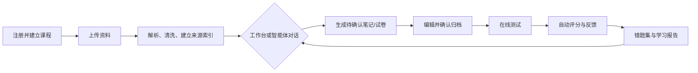

# 复习冲刺智能体平台：产品需求文档（PRD）

| 项目 | 内容 |
| --- | --- |
| 文档状态 | 已确认，MVP 需求基线 |
| 产品形态 | Web 应用（桌面优先、兼容移动端浏览器） |
| 目标用户 | 独立备考的学生 |
| 核心定位 | 以课程资料为依据、由对话智能体驱动的考前复习闭环 |

## 1. 背景与目标

学生的老师 PPT、Word、PDF、作业、题目图片往往分散，临考前需要在有限时间内完成资料整理、背诵、练题、订正和查漏补缺。现有通用对话工具通常无法持续保留课程上下文，也不能将生成内容沉淀为可练习、可打印、可追踪的学习资产。

本产品帮助学生按课程统一管理资料；基于资料和考试画像生成可背、可测的内容；以在线测试、错题和学习报告形成复习闭环。内容必须优先服务考试得分，且可追溯至来源资料。

### 1.1 MVP 目标

1. 让学生可将一门课程的多种资料集中上传、解析和长期保存。
2. 让学生通过课程工作台或自然语言对话，生成并确认笔记、测试与报告。
3. 打通“资料 → 笔记/题目 → 作答 → 错题 → 报告 → 针对性复习”的完整路径。
4. 让笔记和试卷可编辑、可导出、可打印，并保持内容来源可追溯。

### 1.2 非目标（MVP 不做）

- 学习通账号授权、链接抓取或自动同步。
- 手写中文答题图片批改、数学公式识别与公式图片批改。
- 原生 iOS / Android App、邮件、微信或短信提醒（MVP 仅提供站内提醒）。
- 教师、班级、教务管理及多人协作。

## 2. 用户、术语与产品原则

### 2.1 用户角色

仅有学生角色。用户通过邮箱密码或邮箱验证码注册/登录；所有课程、资料、生成内容、答题记录与报告按用户隔离。

### 2.2 核心术语

- **课程项目**：一门学科的长期工作空间，例如“高等数学”。可关联多次考试。
- **考试画像**：某一次考试的日期、题型、分值结构、老师划重点、排除范围和学生自定义要求。
- **学习资产**：资料、笔记、知识点、试卷、题目、作答记录、错题、报告和计划。
- **正式资产**：学生确认后归档、可在课程中复用的学习资产。
- **智能体会话**：围绕当前课程上下文的对话及其任务执行记录。

### 2.3 产品原则

1. **资料优先**：生成内容优先依据学生上传资料；题源优先级为历年真题、老师 PPT、平时作业/阅读作业、其他练习、AI 补充。
2. **先确认后归档**：AI 生成的笔记和试卷默认是“待确认”草稿，学生可编辑，确认后才成为正式资产。
3. **可解释、可追溯**：考点和题目展示来源资料；最少显示文件名与来源类型，并支持跳转到对应资料片段/页码（可用时）。
4. **得分导向**：笔记突出定义、结论、方法、易错点；解析突出得分点、关键词、步骤分和常见失分点。
5. **关键操作可控**：智能体可创建并打开内容，但删除课程/资料、覆盖正式内容等不可逆动作必须二次确认。

## 3. 用户旅程

典型路径：学生建立“高等数学”课程，录入即将到来的期末考试画像，上传 PPT、作业截图和题目照片；在对话中要求“生成第三章、30 分钟、偏计算题的模拟卷”；检查和确认试卷后开始作答；交卷后查看反馈、将错题重练，并依据报告安排当晚复习。

## 4. 功能需求

### 4.1 账户与数据隔离

| 编号 | 需求 |
| --- | --- |
| A-01 | 支持邮箱密码注册/登录和邮箱验证码登录。 |
| A-02 | 用户仅能访问自己的课程与全部关联数据。 |
| A-03 | 支持退出登录、修改密码及基础账户设置。 |
| A-04 | 课程、资料、笔记、试卷、作答记录和报告长期保存，直到用户主动删除。 |

### 4.2 课程项目与考试画像

| 编号 | 需求 |
| --- | --- |
| C-01 | 学生可新建、编辑、归档或删除课程项目。删除前展示影响范围并二次确认。 |
| C-02 | 一个课程可创建并关联多次考试。 |
| C-03 | 考试画像支持日期、题型、分值/满分、老师重点、排除范围、备注和自定义出题偏好。 |
| C-04 | 未填写分值结构时，报告只展示掌握度、目标达成度及置信度；填写后才可计算预计分数。 |
| C-05 | 用户可创建每日计划、设置站内提醒和临近考试加速节奏。邮件提醒作为后续独立里程碑，不属于 MVP。 |

### 4.3 资料上传、解析与管理

| 编号 | 需求 |
| --- | --- |
| M-01 | 支持上传 PPT/PPTX、PDF、DOC/DOCX 及常见图片格式。 |
| M-02 | 支持为资料标记来源类型：历年真题、老师 PPT、平时作业、其他练习、AI 补充。 |
| M-03 | 平台将文件抽取为可检索文本，进行 OCR（图片）、清洗、去重、分块和索引；展示处理中、成功、失败状态。 |
| M-04 | 学生可查看、重命名、按章节/来源归类和删除单份资料；删除资料须二次确认，并提示可能受影响的资产。 |
| M-05 | 学生可通过截图/文件上传学习通作业；不要求学习通账号或链接导入。 |
| M-06 | 生成内容保留可用来源链路，至少能定位文件名、来源类型和相关片段；解析失败的文件不得作为可信题源。 |

### 4.4 对话复习智能体

智能体是核心交互入口，而非普通闲聊工具。它只在当前课程范围内读取已授权的课程上下文，包括资料、考试画像、正式笔记、试卷、答题、错题、报告与计划。

| 编号 | 需求 |
| --- | --- |
| AG-01 | 聊天窗口支持文本输入和直接上传资料；上传内容自动进入当前课程的资料处理流程。 |
| AG-02 | 能理解并执行资料整理、生成笔记、生成测试、解释错题、分析学习报告、创建复习计划等任务。 |
| AG-03 | 信息不足时，主动询问题型、范围、数量、时长、难度、考试重点、输出形式等最少必要边界。 |
| AG-04 | 执行结果以可操作卡片呈现：预览笔记、编辑草稿、开始测试、打开报告、导出文件等。 |
| AG-05 | 可直接创建并打开测试或报告；对删除、覆盖、批量修改等操作先明确说明影响并请求确认。 |
| AG-06 | 会话记录保留任务过程和快捷入口；确认后的学习资产归档到课程，不与聊天记录混淆。 |

### 4.5 背诵资料

| 编号 | 需求 |
| --- | --- |
| N-01 | 支持生成四类内容：章节式精简笔记、考点清单、问答卡片、口诀/速记。 |
| N-02 | 生成前支持选择考试范围、目标时长、重点、受众水平和资料来源。 |
| N-03 | 每份生成内容先进入草稿态；学生可编辑正文、标题和来源引用，并确认归档。 |
| N-04 | 内容突出核心定义、性质、结论、标准方法、常见考法和易错点。 |
| N-05 | 正式笔记支持导出 Markdown、Word、PDF 和打印版。 |

### 4.6 出题、试卷与导出

| 编号 | 需求 |
| --- | --- |
| Q-01 | 生成题型覆盖选择、判断、填空、简答、基础计算/证明。 |
| Q-02 | 用户可指定章节/知识点、考试画像、题型、数量、时长、难度、侧重点及是否纳入已导入题目。 |
| Q-03 | 题目按真实考试题型和知识点权重分配，不机械平均；题目显示轻量来源标记。 |
| Q-04 | 每题包含题干、题型、知识点、标准答案/参考答案、得分导向解析和来源。 |
| Q-05 | 试卷先进入草稿态，学生可编辑题干、答案、解析、分值和顺序后确认。 |
| Q-06 | 支持打印“仅题目版”及“题目 + 答案解析版”；普通文档中题目区在前、答案解析区统一在后。 |

### 4.7 在线测试、评分与反馈

| 编号 | 需求 |
| --- | --- |
| T-01 | 学生可从已确认试卷进入在线测试，支持计时、保存作答、交卷和查看历史记录。 |
| T-02 | 选择、判断、填空等客观题自动判分。 |
| T-03 | 简答、基础计算/证明支持文字作答的 AI 参考评分、参考答案、得分点、缺失点和改进建议。评分必须提示“仅供学习参考，以教师评分为准”。 |
| T-04 | MVP 不承诺手写答题照片与复杂数学公式图片的自动批改；题目图片可作为资料和题干上传。 |
| T-05 | 学生可在交卷后查看逐题结果、解析、知识点和来源，并可发起针对性追问。 |

### 4.8 错题集与学习报告

| 编号 | 需求 |
| --- | --- |
| W-01 | 错误或未掌握的题目自动进入错题集，保留原题、学生答案、正确答案、解析、错因和所属知识点。 |
| W-02 | 支持按课程、考试、章节、知识点、题型和掌握状态筛选；支持重做与手动标记掌握/未掌握。 |
| W-03 | 依据错题状态和用户设置生成间隔复习提醒。 |
| R-01 | 学习报告展示正确率、薄弱知识点、学习时长、题型能力、掌握度/目标达成度、置信度和复习建议。 |
| R-02 | 当存在考试满分与题型分值结构时，报告可展示预计分数和计算依据；信息不足时不得伪造精确分数。 |
| R-03 | 报告可由智能体解释和总结，并能一键转化为针对性小测或复习计划。 |

## 5. 关键规则与状态

### 5.1 生成资产状态

`草稿（待确认） → 已确认（正式资产） → 已归档 / 已删除`

- 草稿可自由编辑、重新生成或丢弃。
- 确认后可继续编辑；修改记录至少保留更新时间及编辑来源（AI/学生）。
- 覆盖已确认资产时，必须显示差异或影响提示并二次确认。

### 5.2 评分与报告可信度

- 客观题以标准答案自动评分。
- 主观文字题由 AI 给出参考性评分和得分点反馈，不作为正式考试成绩。
- 掌握度综合正确率、题目难度、题型、近期作答与重做结果；置信度由题量、覆盖范围和近期程度决定。
- 任何预计分数都展示依赖的试卷结构和估算性质。

### 5.3 来源追溯

- 每个知识点、题目和关键结论保存来源引用集合。
- 若为多份资料改编，标为“综合改编”并列出相关来源；材料不足时标为“AI 补充”。
- 不允许将 AI 补充内容伪标为老师 PPT、作业或历年真题。

## 6. 核心页面

1. **登录/注册页**：邮箱密码、邮箱验证码登录。
2. **课程首页**：课程列表、即将到来的考试、今日计划、提醒和总体进度。
3. **课程工作台**：资料、考试、笔记、试卷、错题、报告、计划和对话入口。
4. **资料中心**：上传、处理状态、来源标记、章节管理、预览与删除。
5. **智能体对话页/侧栏**：课程上下文对话、澄清问题、任务结果卡片和任务历史。
6. **笔记编辑/预览页**：编辑、来源、确认归档和导出。
7. **试卷编辑与在线测试页**：试卷配置、试题编辑、计时作答、交卷和结果。
8. **错题集与报告页**：筛选、重练、掌握标记、指标图表、建议和复习计划。

## 7. 数据对象（概念模型）

| 对象 | 关键字段 |
| --- | --- |
| User | id、邮箱、认证信息、提醒偏好 |
| Course | id、user_id、名称、学科、状态 |
| Exam | course_id、日期、题型、满分/分值结构、重点、偏好 |
| Material | course_id、文件信息、来源类型、章节、解析状态、原文/索引 |
| SourceReference | asset_id、material_id、片段/页码、置信信息 |
| Note | course_id、类型、正文、状态、版本、来源集合 |
| Quiz / Question | course_id、exam_id、题干、类型、答案、解析、分值、知识点、状态、来源集合 |
| Attempt | quiz_id、user_id、答案、用时、得分、逐题反馈 |
| Mistake | question_id、attempt_id、错因、掌握状态、下次复习时间 |
| Report | course_id、时间范围、指标、建议、置信度 |
| AgentSession / Task | course_id、消息、意图、澄清信息、执行状态、结果资产链接 |

## 8. 非功能需求

- **隐私与安全**：私有课程数据隔离；鉴权后端强制校验资源归属；敏感认证信息安全存储；下载链接需授权。
- **可靠性**：大文件解析、AI 生成、导出等异步任务须有状态、失败原因和安全重试机制；不得因失败产生半归档资产。
- **可用性**：上传、生成、测试、报告等关键状态可见；移动浏览器能完成阅读、对话和基础作答。
- **内容质量**：对资料不足、冲突或无法解析的情况明确告知，不虚构来源和确定性结论。
- **审计性**：记录正式资产的生成时间、确认时间、来源和用户编辑时间；记录删除确认。
- **成本控制**：解析、检索、生成和评分任务可观测；针对重复请求复用已解析资料和可缓存结果。

## 9. MVP 验收标准

1. 新用户能登录、创建课程及考试画像，并上传上述四类资料中的至少一种。
2. 平台能展示资料处理状态，并让已解析资料成为智能体与生成任务的依据。
3. 学生可在对话中上传资料或请求生成内容；缺少关键参数时，智能体会追问而非直接盲目生成。
4. 学生能生成、编辑、确认并导出至少一种笔记和一份试卷；导出的试卷支持仅题目及含答案解析两种格式。
5. 学生能完成含客观题和文字主观题的在线测试，获得逐题反馈；客观题自动评分。
6. 错题会自动进入可筛选、可重做、可标记掌握状态的错题集。
7. 报告能展示约定的六类核心指标，并在无分值结构时不展示伪精确预计分数。
8. 笔记考点和题目可查看来源；AI 补充与材料题源可区分。
9. 删除课程/资料、覆盖正式资产等操作会要求二次确认。
10. 不同账号无法读取对方课程数据。

## 10. 后续版本路线图

### V1.1：批改与导入增强

- 手写中文答题图片识别、数学公式识别与参考性批改。
- 学习通授权/链接导入的合规可行性评估与接入。
- 更细粒度的资料页码/区域回溯。
- 邮件提醒（含地址验证、退订/偏好、频控与投递可观测性）。

### V1.2：移动与复习体验增强

- 原生移动端或 PWA 深度适配。
- 微信/短信等提醒渠道（需用户授权）。
- 更丰富的记忆卡、间隔重复算法与离线打印模板。

### V2：协作场景（待单独立项）

- 教师/班级角色、教师资料分发、班级学习洞察与隐私边界设计。
